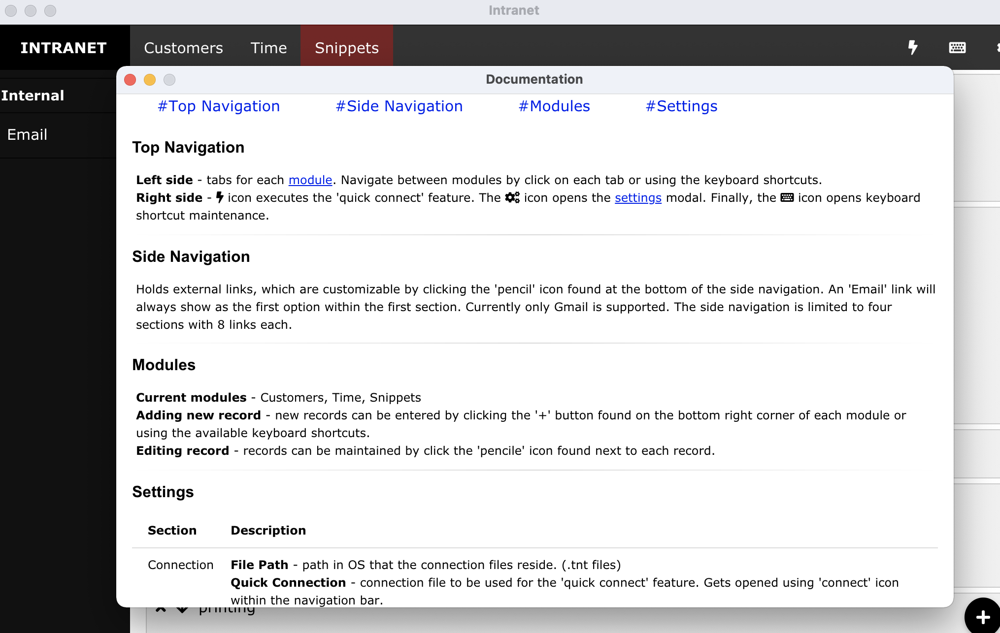

# intranet (dev toolkit)

** This repository has been cloned from a private version and archived. Purpose of this project was to learn reactJS and electroJS, so best practices my not have been fully followed. Also, the project is in an 'incomplete' state and is being completely re written from scratch.

A macOS and windows application built with electronjs and reactjs. Motivation behind this project was to get my hands dirty with electronjs and reactjs. It was a very first and bare go at implementing those technologies. This application was used daily while working because it organized my connectinos (ssh config file), let me track my tasks and time spent on them and allowed for storing of 'snippets' that I found useful. This is one of the main reasons I did not get into full TDD because I was building it as I went along my day and just wanted it to work, so that it could help me be more productive as a developer.

### Features
 - Connections module: kept track of different connections to various client servers. Opens connections to server by sending information to default SSH client on the local machine. Opened web maintanable web URLs that in theory synced up with localforwards defined within the SSHConfig file.
 - Time module: Allowed entry of tasks you are working on or have completed. Can capture things like time, billable or non-billable, completed, not completed or in progress.
 - Snippets module: Simple way to store quick commands, code or any reminders you wanted for safe keeping and to reference back to.
 - Email (Gmail only): Runs Gmail in a seperate child browser window.
 - Data for each module could be mass uploaded, downloaded or deleted. Files were dumped as JSON.
 - Keyboard shortcuts available throughout each module. For example, 'n' would take you to creation of a new record.
 - Quick connect shortcut - allowed user to specify a connection file that they can access with a click from the top navigation bar.
 - Sidebar links - Maintanable external link section. You can add links to your favorite websites like stack overflow. Each link opened in the default web browser.

### Technologies
 - ElectronJS
 - ReactJS
 - Dexie.js (IndexedDB)

### Images
  
  
  
  
  
  
  
  
  
